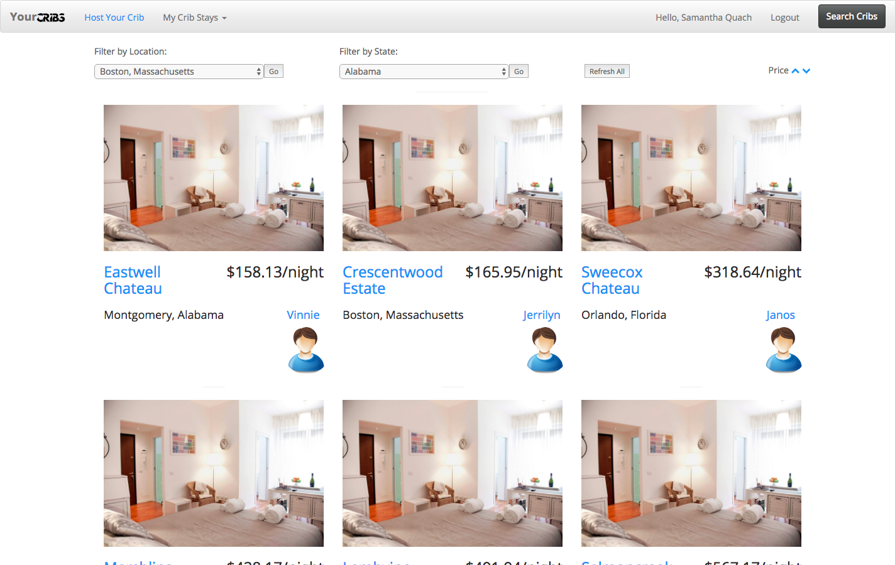
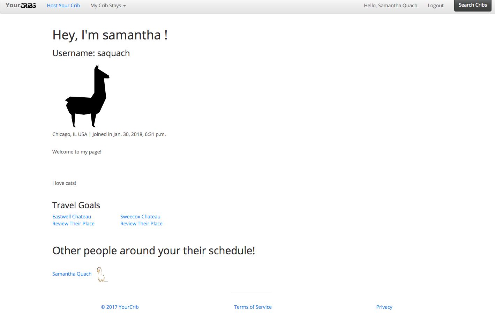
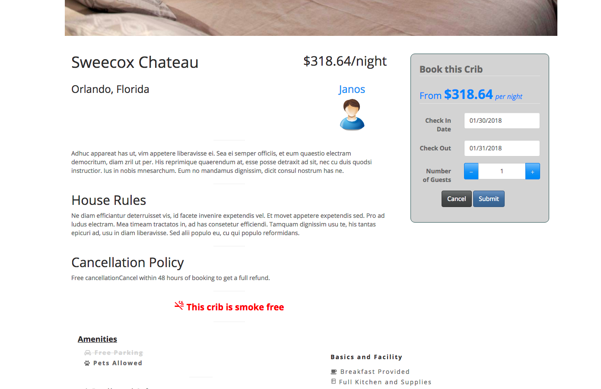
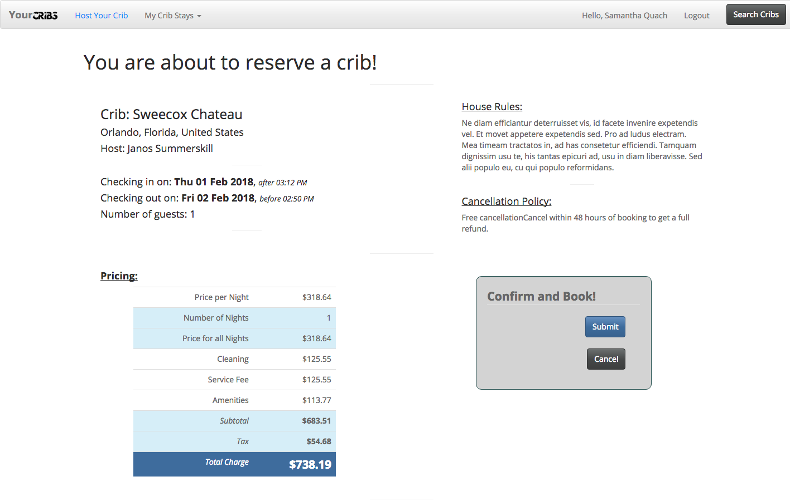

# My Cribs Python Project
Replicated AirBnb Web Application using Python Stack

## Overview
Made an online hospitality service, for people to lease or rent short-term lodging including vacation rentals, apartment rentals, homestays, hostel beds, or hotel rooms. This project contains Python, jQuery, Javascript, and Django. This project timeline: 1 Week; SCRUM methodology.

## Usage
`` git clone: https://github.com/samq1/airBnB.git ``

## Installation
``` 
pip install bcrypt
```
## Technology
- Database: Sqlite
- Django
- Python
- Javascript
- jQuery








